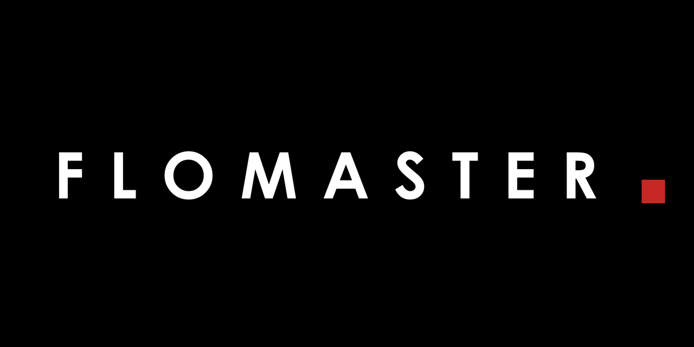
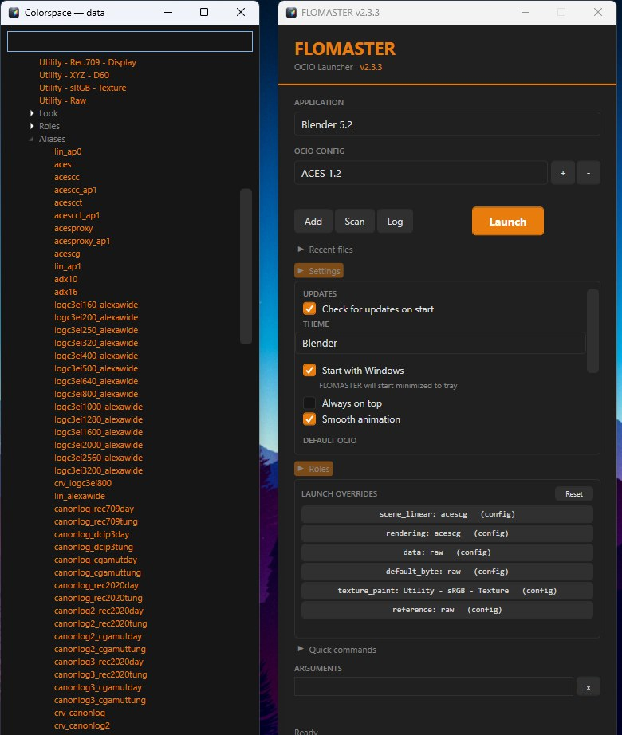
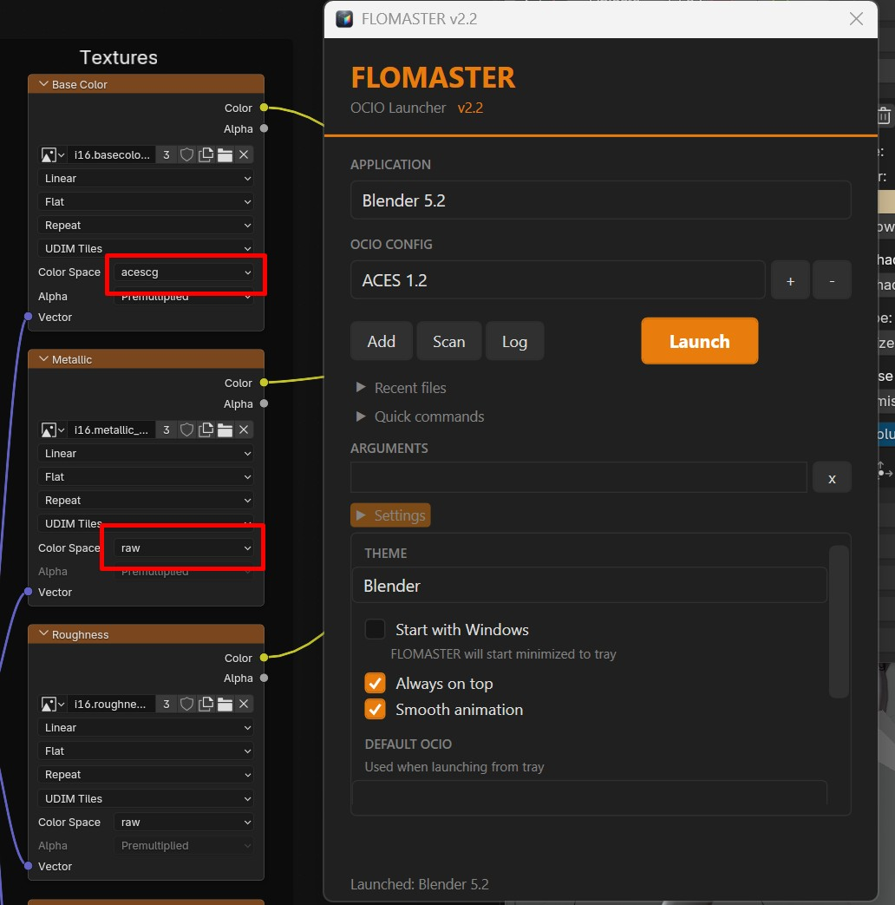
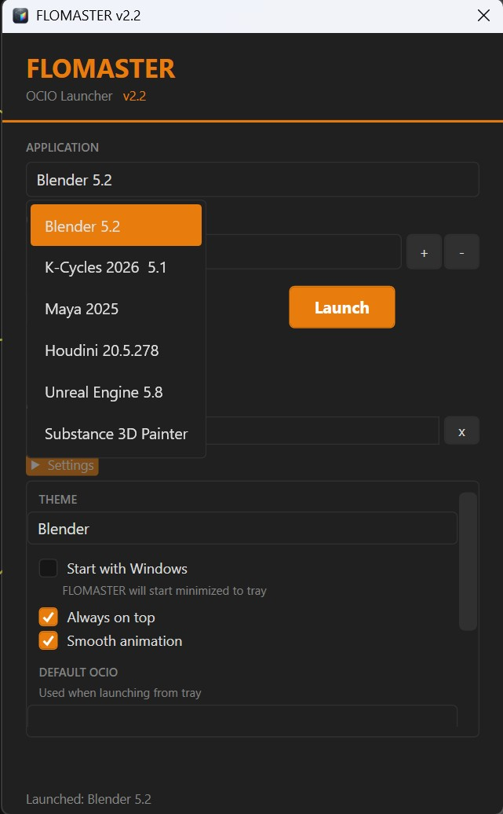
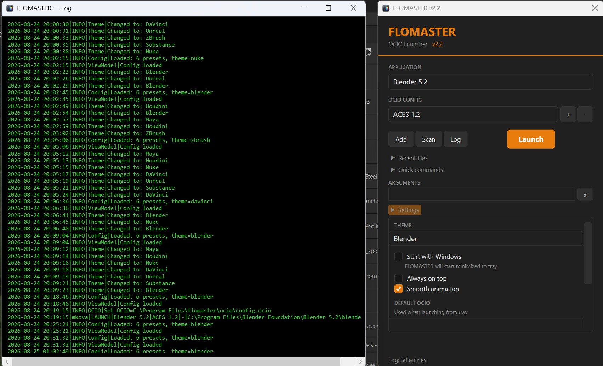

# FLOMASTER



[](https://github.com/abyrvalg379/FLOMASTER/releases/latest)
[](https://github.com/abyrvalg379/FLOMASTER#quick-start)
[](test/smoke_flomaster.py)

**OCIO Launcher** — a unified launch point for DCC applications with custom ACES 1.2 color space support.

*Документация на русском: [README.ru.md](README.ru.md)*

---

## Quick Start

1. Download the latest release from [Releases](https://github.com/abyrvalg379/FLOMASTER/releases/latest)
2. Extract the archive
3. Run `FLOMASTER.exe`
4. The launcher will automatically find installed DCC applications

### Requirements

- Windows 10/11
- .NET 8 Desktop Runtime (bundled in the self-contained build — no installation needed)

---

## Screenshots



| | |
|:---:|:---:|
|  |  |



---

## What's New in v2.3.5

- **Projects panel** — point it at your project folders and open any project file without digging through Explorer: flat list of every file inside, relative paths, name filter; a click opens it with the current preset + OCIO and fills Recent
- **Built into the launcher** — same window, same theme, same hover highlights, same expand animation; roots stored additively in the config
- **Native formats only** — `.blend .spp .ma .mb .hip .hipl .hipnc .nk`; exports and bakes (`.fbx .obj .stl`) are intentionally not listed

### [v2.3.4](https://github.com/abyrvalg379/FLOMASTER/releases/tag/v2.3.4) — launch profiles + recent files fix
Named app + OCIO + arguments snapshots with tray quick-launch; recent files click repaired (handler had been silently lost); panels reordered Roles → Profiles → Recent → Settings → Quick → Arguments.

### [v2.3.3](https://github.com/abyrvalg379/FLOMASTER/releases/tag/v2.3.3) — OCIO role picker + auto-update
Per-preset role overrides with a Blender-style family-grouped picker; auto-update check on start with one-click install. Original config untouched.

### [v2.3.2](https://github.com/abyrvalg379/FLOMASTER/releases/tag/v2.3.2) — OCIO config validation
Key roles are shown and validated per config: missing `default_byte` or `data`, roles pointing to unknown colorspaces — warnings right in the UI and the log.

### [v2.3.1](https://github.com/abyrvalg379/FLOMASTER/releases/tag/v2.3.1) — tray fixes
Tray menu now updates with presets; items with missing exes warn instead of doing nothing.

### [v2.3](https://github.com/abyrvalg379/FLOMASTER/releases/tag/v2.3) — pipeline-correct defaults
Explicit ACES roles in the bundled config: 8-bit images load as `raw`, float (EXR) as `acescg` — lowercase interchange-safe aliases, fixing the old sRGB-fix regression in Blender 5.1+.

<details>
<summary><b>What's New in v2.2</b></summary>

- **7 color themes** — Houdini and Nuke colors sampled from the real application UIs
- **Fully themed interface** — checkboxes, scrollbars and dropdown popups follow the selected theme, rounded corners everywhere
- **Smooth panel animation** — native WPF animation with easing (toggleable in Settings)
- **Extended drag & drop** — `.mb`, `.hipl`, `.hipnc` added
- **Window opens in the top-right corner** of the screen
- MVVM architecture under the hood

</details>

---

## Features

### DCC Color Themes
7 color schemes inspired by the software they represent:

| Theme | Accent | Base |
|-------|--------|------|
| **Blender** | Orange | Dark graphite |
| **Maya** | Cyan | Blue-gray |
| **Houdini** | Red-orange | Dark, sampled from Houdini UI |
| **Nuke** | Light gray | Graphite — monochrome, like Nuke itself |
| **DaVinci** | Pink-red | Purple-navy |
| **Unreal** | Blue | Cool graphite |
| **Substance** | Green | Black |

Every control follows the theme: buttons, checkboxes, the scrollbar, dropdown menus and the launch button hover state.

### Auto-Scan
Finds: Blender, K-Cycles, Maya, Houdini, Nuke, DaVinci Resolve, Unreal Engine, Substance Painter. Custom scan paths can be added in Settings.

### Quick Commands
Expandable menu with launch arguments for each application.

### Recent Files
Recently opened files: `.blend`, `.spp`, `.ma`, `.mb`, `.hip`, `.hipl`, `.hipnc`, `.nk`

### Drag & Drop
- `.exe` → create a preset (name is asked)
- Project file → open in the selected application with OCIO applied

### Context Menu
Right-click files → "Open in FLOMASTER"

### System Tray
Minimizes to tray, quick launch with the default OCIO config.

### Logging
All launches are logged with timestamps, user, application, OCIO config and exit codes. View logs via the Log button.

### Settings
- **Theme** — color theme select
- **Start with Windows** — auto-start minimized to tray
- **Always on top** — window above all others
- **Smooth animation** — enable/disable panel animation
- **Default OCIO** — default config for tray launches
- **Scan paths** — custom folders for auto-scan
- **Shortcuts** — Start Menu and desktop shortcuts

---

## Structure

```
FLOMASTER/
├── FLOMASTER.exe             ← Application (self-contained)
├── flomaster.ico             ← Icon
├── flomaster_logo.png        ← Logo
├── LICENSE.txt               ← MIT License
├── README.md                 ← This file
├── README.ru.md              ← Russian README
└── ocio/                     ← ACES 1.2 config
    ├── config.ocio
    └── luts/
```

User data (auto-created in `%APPDATA%\FLOMASTER\`):
```
├── launcher_config.json      ← Settings
└── flomaster.log             ← Launch log
```

---

## OCIO Support

| Application | Support |
|-------------|---------|
| Blender | Native (OCIO env variable) |
| Maya | Native (OCIO env variable) |
| Houdini | Native (OCIO env variable) |
| Nuke | Native (OCIO env variable) |
| DaVinci Resolve | Native (OCIO env variable) |
| Substance Painter | Native (OCIO env variable) |
| Unreal Engine | Via `-ocio=` argument (does not read the env variable) |

---

## Build from Source

```bash
cd FLOMASTER_CS
dotnet publish -c Release -r win-x64 --self-contained true -p:PublishSingleFile=true -p:IncludeNativeLibrariesForSelfExtract=true
```

Requires the .NET 8 SDK. Output: a single ~155 MB self-contained executable.

---

## License

MIT License — see [LICENSE.txt](LICENSE.txt). Third-party attributions: [NOTICE.md](NOTICE.md)

OCIO config — Academy of Motion Picture Arts and Sciences license. See ocio/LICENSE.md for details.

---

## Related Tools

| Tool | Description |
|------|-------------|
| [STUKACH](https://github.com/abyrvalg379/STUKACH) | Pipeline asset validator for Blender |
| [LAMPOCHKA](https://github.com/abyrvalg379/LAMPOCHKA) | Scene light manager |
| [Switch_UDIM](https://github.com/abyrvalg379/Switch_UDIM) | Single ↔ UDIM texture switcher |
| [FILTER](https://github.com/abyrvalg379/FILTER) | Toggle visibility/selection by type, name, collection + bulk modifier management (apply, remove, diff) |
| [KARUSELKA](https://github.com/abyrvalg379/karuselka) | Fast camera turntable rig: orbit or object spin |
